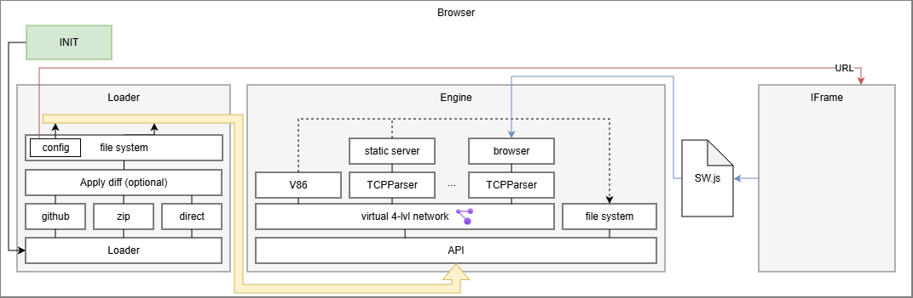

# RunWebBox: Интерактивная платформа для полного цикла разработки в браузере

Демо: https://dimathenekov.github.io/RunWebBox/

RunWebBox — это инновационная веб-платформа, позволяющая создавать, редактировать и запускать клиент-серверные приложения напрямую в браузере. Используя мощь эмуляции x86 через v86, мы предоставляем изолированные виртуальные среды, где можно развернуть как фронтенд, так и бэкенд компоненты без необходимости удаленного сервера. Всё работает в безопасной песочнице браузера, обеспечивая полную изоляцию кода.

🎓 Для студентов: Сдавайте лабораторные работы так, чтобы преподаватель мог их запустить в один клик. Не трайте денги на VPS, хостинги и т.д!<br>
📚 Для авторов: Создавайте интерактивные статьи, где читатели могут менять код и сразу видеть результат — даже если для работы нужен Node.js, Python или любая другая серверная технология<br>
👨‍🏫 Для преподавателей: Показывайте сложные концепции через живые примеры, которые работают у всех студентов одинаково

**Начните создавать интерактивные демо уже сегодня!**

## Статус разработки

## Технический стек

Frontend: React + TypeScript + Vite + Redux<br>
Стили: TailwindCSS<br>
Инструменты: ESLint + Prettier<br>
Редактор: Monaco-editor<br>
Виртуализация: v86 для эмуляции x86 в браузере<br>

## Приемущества

- Полностью в браузере!

## Встаивание в Вашу страницу

- Ссылка
- iframe с редактром и без
- `<a href="..."></a>`

## Источники Вашего проекта

- Github (?github=...)
- URL (GET-param, ?data=...base64(zopfli(project))...)
- webboxurl (?webbox_url=URL)
- Diff URL (GET-param, ?(github|webbox_url)=...&diff=...base64(zopfli(diff))...)

> [!NOTE]
> Для zip_url метода URL должен поддерживать CORS

## Предлагаемые виртуальные машины

- static server
- V86 + alpine linux + (node+npm/GO/PHP/Python/JAVA/MySQL/PostgreSQL)
- [ ] V86 + alpine linux + docker + any docker from [i386](https://hub.docker.com/u/i386)
- [ ] https://github.com/stackblitz/webcontainer-core/issues/458#issuecomment-1344317254

> [!NOTE]
> Интернет... Выхода в интернет возможен только для http запросов и только с CORS 😢.
> Но для обхода CORS вы можете использовать расширения для браузера либо прокси сервера.
> Мы запоминм какие запросы использовались и сохраним в `internet.json` файл, который другие пользватели смогут ипользовать для offline режима!

## Архитектура



## Сеть

Предлагается так же возможность настройка простейших сетей. Сеть включает в себя:

- [] Виртуальные машины (Или статичный сервер)
- Интернет файл
- DNS-сервер
- Клиент (браузер)
- Соединения
  Машины общаються объектами: {eth:{src,dest}, ipv4:{src,dest}, tcp:{sport:,dport:}}. Такое решение было принято для быстрого взаимодействия между клиентом и статичным сервером.

## Лицензия

```text
The MIT License (MIT)

Copyright (c) 2025 Dmitry Tsenekov

Permission is hereby granted, free of charge, to any person obtaining a copy
of this software and associated documentation files (the "Software"), to deal
in the Software without restriction, including without limitation the rights
to use, copy, modify, merge, publish, distribute, sublicense, and/or sell
copies of the Software, and to permit persons to whom the Software is
furnished to do so, subject to the following conditions:

The above copyright notice and this permission notice shall be included in
all copies or substantial portions of the Software.

THE SOFTWARE IS PROVIDED "AS IS", WITHOUT WARRANTY OF ANY KIND, EXPRESS OR
IMPLIED, INCLUDING BUT NOT LIMITED TO THE WARRANTIES OF MERCHANTABILITY,
FITNESS FOR A PARTICULAR PURPOSE AND NONINFRINGEMENT. IN NO EVENT SHALL THE
AUTHORS OR COPYRIGHT HOLDERS BE LIABLE FOR ANY CLAIM, DAMAGES OR OTHER
LIABILITY, WHETHER IN AN ACTION OF CONTRACT, TORT OR OTHERWISE, ARISING FROM,
OUT OF OR IN CONNECTION WITH THE SOFTWARE OR THE USE OR OTHER DEALINGS IN
THE SOFTWARE.
```
