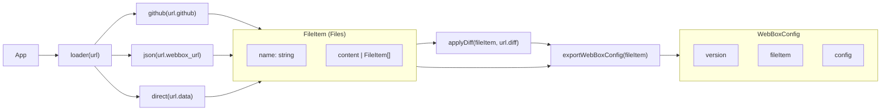

# Loader

Файлы в этой дериктории отвечают за импорт и экспорт проекта. Основная работа с проектом происходит с WebBoxConfig. Это json-файл содежающий файловую систему, информацию о машинах и их подключениях.
Под машинами подразумевается сетевое оборудование обрабатывающее запросы (в том числе внутренний браузер)

Вот диаграмма импорта:

